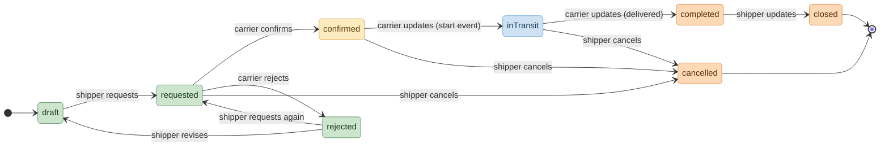
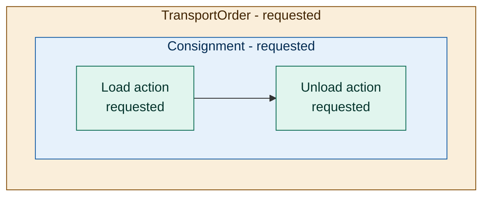
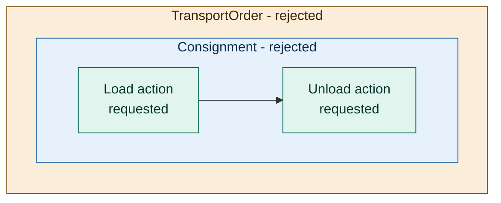
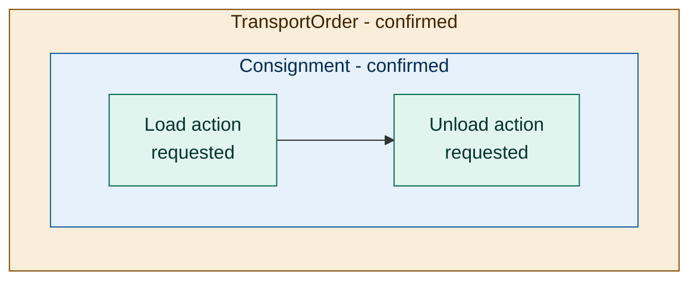
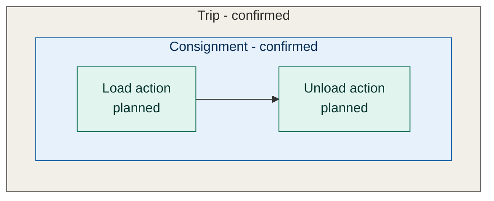
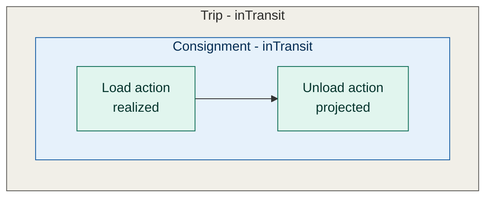
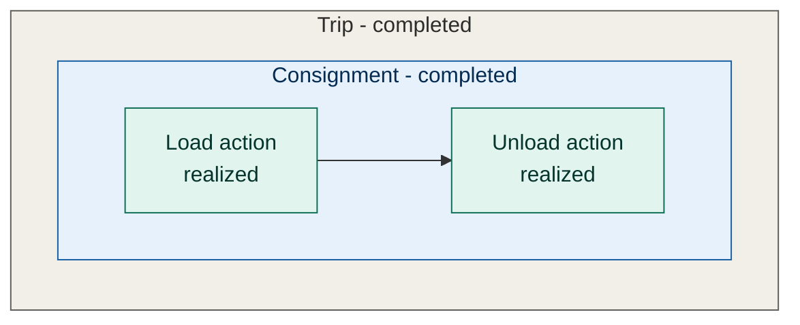
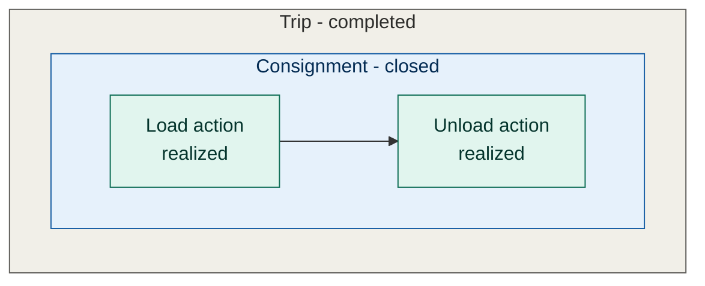
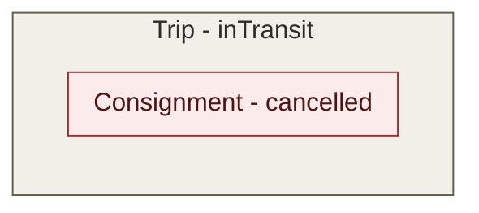

Entity status
=============================================

A recurring pattern in OTM5 is the split between:

* **Entity status** - the state of the entity itself within its business or
   administrative workflow. The allowed values depend on the entity and profile
   and describe progress such as requested, confirmed, inTransit, completed,
   cancelled, accepted or closed.
* **Action lifecycle** - the time phase of an action or event. It tells you
   whether the same action data is represented as requested, planned,
   projected, actual or realized.

The two are related, but they are not the same axis: entity status describes
the workflow state of the entity, while action lifecycle describes when the
action data applies.

<small><em>Disclaimer: This example does not mean that every application has to
follow the actor role and responsibilities. It might depend on the use case to
determine the exact details. This documentation simply tries to illustrate the
two concepts by explaining them with an example.</em></small>

---

### Consignment - status lifecycle overview



---

### Walkthrough of contracting a carrier with a single consignment

**1. Draft -> requested**

The shipper drafts a transport order containing one consignment, determining
when and how the goods must be delivered. This stage is about defining the
requested actions and their constraints. This status is rarely communicated
since it is often part of an internal application. Once the draft is ready it
switches to **requested** and can be shared with carriers. At this point all
underlying actions (stops, moves, loads, etc.) are in the **requested** action
status.



**2.1 Requested -> rejected**

The carrier may decide to decline the request by rejecting it. This then depends
on the application how to deal with this. It may decide to do one of the
following:

* The transport order and consignment may be offered to another carrier and will
  be requested again.
* They can be revisited and constraints might be changed. In this case they will
  go back to **draft**.
* It might be possible that the transport order simply stays **rejected**. The
  shipper might decide then to create a new **requested** transport order
  containing the same or new consignments.



**2.2 Requested -> confirmed**

If the carrier accepts the terms of delivery then it can respond with a
**confirmed** message.

Now in this example, confirming a transport order and planning it into a trip
happens at different points in time. The carrier might first just confirm an
order but does not yet have planned delivery times. Then it could just share a
**confirmed** message without updating actions containing planned times.

This might be as simple as the following message:

```json
{
   "entity": {
      "id": "01736a8f-6b8e-5262-86ec-ce2eeb1d3647",
      "status": "confirmed",
      "entityType": "transportOrder"
   },
   "eventType": "updateEvent"
}
```

In this case the consignment could have the status **confirmed** but all
related actions are still in **requested**.



At a later point, the carrier is then able to possibly consolidate multiple
consignments within a trip planning update so that eventually all the actions
will be **planned**.



**3. Confirmed -> inTransit -> completed**

Eventually that trip becomes **inTransit** - typically as soon as a start event
such as a GPS location update is registered. This includes that the consignment
also becomes **inTransit**. Meanwhile, its actions progress through the action
lifecycle phases *projected*, *actual* and *realized*.



Often if the **unload** action for a consignment is *realized*, then the
consignment can be considered **completed**. But this is application dependent.
Note: An unsuccessful action still becomes *realized*, but with a `failed`
result status.



**4. completed -> closed**

The status **completed** is more of an operational state while the status
**closed** is used to indicate that the entity is also administratively closed.
The entity status can in contrast to action lifecycles often be determined only
by the owner of the entity. Once all administrative tasks are done then the
status will reach **closed**.



**5. Cancellation**

At any step before status **completed**, the owner can cancel. The transport
order or consignment becomes `cancelled` and, conceptually, all actions become
*realized* with a `cancelled` result. In practice only the single
consignment-level `cancelled` reference needs to be communicated - the
individual actions do not each have to be present.



Can be achieved by the owner simply sending a message containing:

```json
{
   "entity": {
      "id": "01736a8f-6b8e-5262-86ec-ce2eeb1d3647",
      "status": "cancelled",
      "entityType": "consignment"
   },
   "eventType": "updateEvent"
}
```