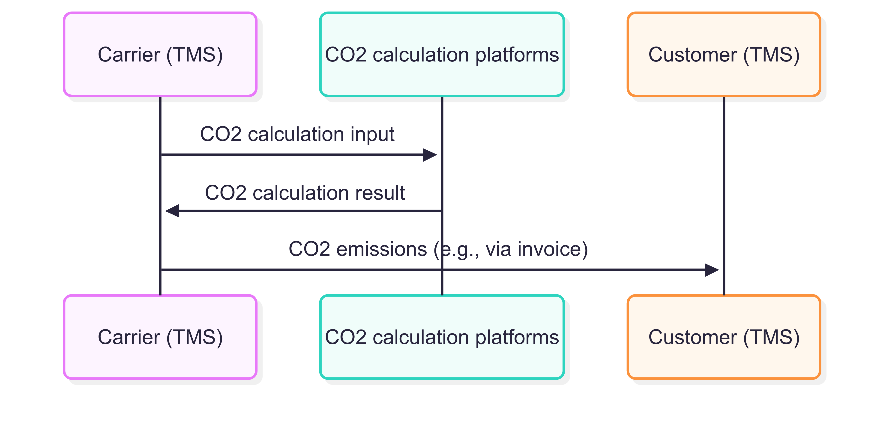

# OTM Profile - Carbon footprint

:::warning
This profile is still a work in progress.
:::

:::info
The message models of OTM profiles are specified and maintained here: https://sutc.semantic-treehouse.nl/specifications

Direct link to the DRAFT versions OTM Profile - Carbon Footprint: [input](https://sutc.semantic-treehouse.nl/message-model-tree/Message_9e14bbd6-72fc-4942-915f-9c633bc95744?panes=element_tree:Message_9e14bbd6-72fc-4942-915f-9c633bc95744:ajgayz:primary) & [results](https://sutc.semantic-treehouse.nl/message-model-tree/Message_cd3ebf06-0da2-43c3-956e-1f6b75ea5981?panes=element_tree:Message_cd3ebf06-0da2-43c3-956e-1f6b75ea5981:wgyb5v:primary)
:::

## Introduction / context

The exchange of CO₂ information in the transport sector is becoming increasingly important, partly due to legislation such as the **Corporate Sustainability Reporting Directive (CSRD)**. This directive requires companies to report on their greenhouse gas emissions, with emissions from purchased transport often reported as an indirect emission.

For the calculation of CO₂ emissions, the **Greenhouse Gas (GHG) Protocol** is the most widely accepted protocol globally. Various specific calculation methods (such as EN 16258 and the GLEC Framework) build upon this. The details of these calculation methods are outside the scope of this OTM profile. This profile focuses on the standardized exchange of the necessary input data to perform CO₂ calculations and the final end result.

This OTM profile will contribute to transparency regarding how emissions are calculated and what the exact scope of the calculation is. Transparency is essential because many factors are involved in the calculation, and insight into these is crucial for correct interpretation and comparability of the CO2 emissions.

## Scope OTM Profile

Carriers often use calculation platforms to determine the CO₂ emissions of their transport trips. The input data for these calculations is delivered to these platforms, which then calculate the CO₂ emissions. This result can then be used by the carrier for reporting to their customers or for other (internal) purposes.

To automate this information exchange, two specific profiles have been developed:

1. **CO₂ Calculation Input:** This profile standardizes the data exchanged from a source system (e.g., a Transport Management System) to the calculation platform. It includes all necessary details about the trip, vehicle, fuel, and cargo that are essential for the CO₂ calculation.
2. **CO₂ Calculation Result:** This profile standardizes the CO₂ emission results calculated by the calculation tool and sent back to the carrier. The carrier can then exchange these with other parties (such as the customer). It concerns the calculated CO₂ emissions for a specific transport trip or consignment (still under discussion).

The sequence diagram below visualizes the information flows between the carrier's TMS, the CO₂ calculation tool, and the customer, and indicates where these OTM profiles are applied.

Reporting CO2 emissions to the customer is **out of scope** for these OTM profiles. This could potentially be communicated on the invoice. Note: this data would be at the item level (under ""[ITEM ATTRIBUTES](https://stpe.semantic-treehouse.nl/message-model-tree/Message_1528564716_00391504?panes=element_tree:Message_1528564716_00391504:zst27c:primary&details=element:Element_1528564930_00038185:zst27c)"), not the trip level, which means a calculation is required.

## Foundation for CO₂ profiles

The OTM profiles for calculation the CO₂ emissions are based on the information needs identified within the [DALTI](https://www.dalti.nl/) program. DALTI has analyzed the specific data elements required for an accurate CO₂ calculation and for reporting the result.

This analysis forms the direct basis for the structure and content of the OTM profiles. When translating these requirements into OTM profiles, an effort was made to align as much as possible with the existing Open Trip Model (OTM). However, it may be that not all necessary data elements can be directly mapped one-to-one onto the current OTM. This may lead to proposed changes or extensions to the core OTM (trip) model in the future.

The detailed information requirements, as established by DALTI, can be found here: <a href="/documents/DALTI_Uniforme_kernset_CO2e.xlsx" target="_blank">DALTI CO₂ information needs</a>

## OTM Profile Structure - **To be filled**

The detailed structure of both OTM profiles is maintained and can be consulted via the SUTC Semantic Treehouse. Both profiles are nearly identical. They're based on `trip` data, and the CO₂ calculation results repeat all input information while adding the final outcomes.

- **Link to OTM Profile - CO₂ Calculation Input:**  [link](https://sutc.semantic-treehouse.nl/message-model-tree/Message_9e14bbd6-72fc-4942-915f-9c633bc95744?panes=element_tree:Message_9e14bbd6-72fc-4942-915f-9c633bc95744:y700pg:primary)
    
- **Link to OTM Profile - CO₂ Emissions Output:**  [link](https://sutc.semantic-treehouse.nl/message-model-tree/Message_cd3ebf06-0da2-43c3-956e-1f6b75ea5981?panes=element_tree:Message_cd3ebf06-0da2-43c3-956e-1f6b75ea5981:znyahv:primary)
    
The profiles are modeled according to the principles of the Open Trip Model (OTM) and use standard OTM entities where possible, supplemented with specific extensions for CO₂-related data.

## Relation to other standards

In addition to the OTM profiles described here, which are specifically aimed at the exchange of input and output data for CO₂ calculations in transport logistics, there are other (international) standards and initiatives relevant to the exchange of carbon footprint data. These can be complementary to the OTM profiles or have a broader scope. Some important examples are:

- **IDTA Asset Administration Shell (AAS) - Submodel Carbon Footprint:** Standardizes the description and exchange of the [Product Carbon Footprint (PCF)](https://industrialdigitaltwin.org/wp-content/uploads/2024/01/IDTA-2023-0-9-_Submodel_CarbonFootprint.pdf), including the CO₂ impact of transport as part of the product life cycle. It defines, among other things, scope, methodology, and allocation.
- **Digital Product Passports (DPP) & UN/CEFACT Transparency Protocol:** ESPR-driven Digital Product Passports require detailed product information, including CO₂ data. The [UN/CEFACT Transparency Protocol](https://uncefact.github.io/spec-untp/docs/specification/DigitalProductPassport/) provides a framework for this. Data sharing initiatives such as [Catena-X](https://catena-x.net/) apply this.