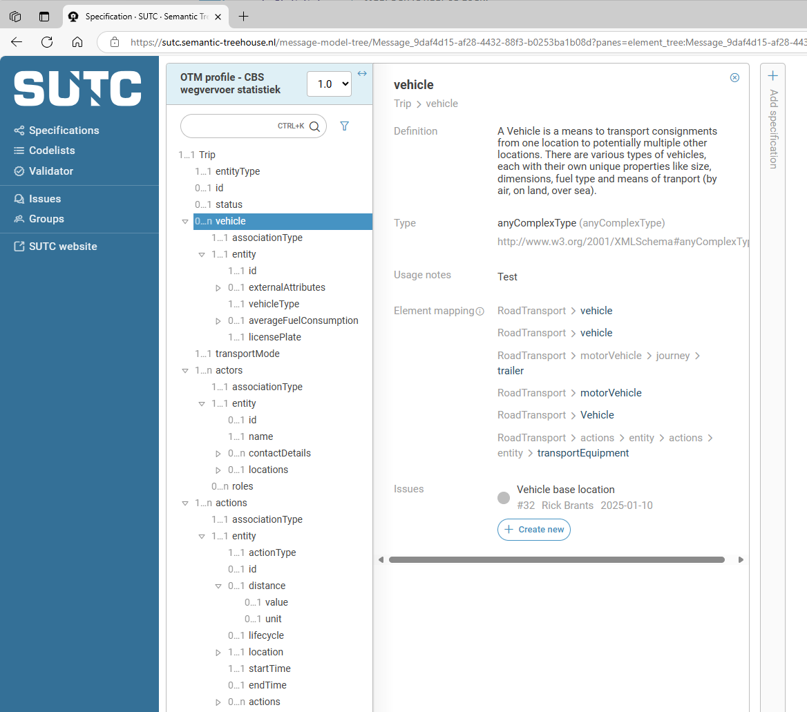

# OTM Profile - CBS Road transport statistics

:::info
The message models of OTM profiles are specified and maintained here: https://sutc.semantic-treehouse.nl/specifications

Direct link to the [OTM profile - CBS wegvervoer statistiek message model v1](https://sutc.semantic-treehouse.nl/message-model/MessageModel_215aae56-e05f-4b4b-99bb-d7b751d477ee)
:::

## Overview

Statistics Netherlands (CBS) publishes figures on road freight transport. These figures provide insight into the use of the Dutch road network and the transit and distribution function of Dutch road transport. The results are also used to determine policy in the field of environment and traffic safety.

Road transport carriers that are required to provide the requested trip data by the CBS can use this profile. The data is provided by their software system in a JSON format according to the OTM profile. This automatically created message contains data about the journeys (trips) that are carried out.

Read more about this requirement at [CBS website](https://www.cbs.nl/nl-nl/deelnemers-enquetes/bedrijven/overzicht-bedrijven/wegvervoer) and [CBS Tijd besparen](https://www.cbs.nl/nl-nl/deelnemers-enquetes/bedrijven/meer-over-cbs-enquetes/tijd-besparen).

## Trip entity 

The basis for the CBS profile is the OTM realized `trip`.

Important associations that are part of the message model include `vehicle` used for the transport, its license plate, the `actors` (in particular the information about the carrier) and a complete set of `stop` and `move` actions that specify the trip from start to end location. Furthermore the profile includes data fields to specify the type of goods and its weight.

The full message specification of the CBS profile is described here: [OTM profile - CBS wegvervoer statistiek message model v1](https://sutc.semantic-treehouse.nl/message-model/MessageModel_215aae56-e05f-4b4b-99bb-d7b751d477ee). Below a screenshot.

## Validation

You can use the [Validator](../developers/validation) to validate your implementation according to the OTM profile specification.

