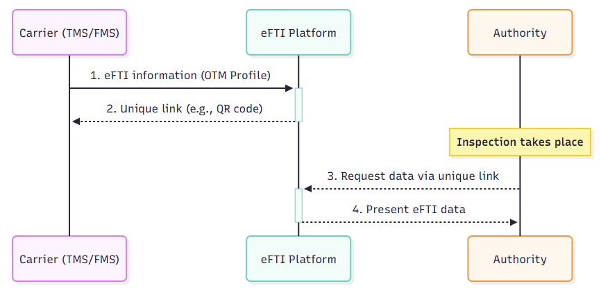

# OTM Profile - Carbon footprint

:::warning
This profile is still a work in progress.
:::

:::info
The message models of OTM profiles are specified and maintained here: https://sutc.semantic-treehouse.nl/specifications

Direct link to the DRAFT version [OTM Profile - Carbon Footprint](https://sutc.semantic-treehouse.nl/message-model/MessageModel_74ddde7e-578a-4790-b674-15274637d902)
:::

## Introduction / context

The eFTI Regulation ([Regulation (EU) 2020/1056](https://eur-lex.europa.eu/legal-content/EN/TXT/?uri=CELEX:32020R1056)) sets the rules for sharing transport information digitally between **businesses** and **enforcement authorities**. Simply put, it ensures that a digital consignment note (or other mandatory document) has the same legal status as its paper equivalent throughout the EU, and that authorities are required to accept it. This gives companies the right to go digital, which helps them save money and reduce paperwork.

This digital exchange happens through certified **eFTI platforms**. A company sends its transport data to a platform, and when an inspection occurs, the driver can simply show a QR code to grant the authority access.

To deliver data to these platforms unambiguously, OTM has developed the eFTI profile. Where the eFTI regulation defines the legal data requirements (the **"what"**), the OTM profile helps to structure and standardize this information for the exchange (the **"how"**). This saves developers from the complexity of interpreting the legislation themselves and handling the data delivery to these eFTI platforms. The content of this OTM profile is based on the analysis of the eFTI data requirements conducted by the [Topsector Logistiek](provide link).

## Scope OTM Profile

T share transport information digitally, businesses must use a certified eFTI platform. Such a platform, often operated by a certified **eFTI service provider**, acts as a secure and trusted gateway between the business and the enforcement authority.

To automate the delivery of data to these platforms, this OTM profile has been developed. It standardizes the information exchanged from the carriers's IT system (such as a TMS) to the eFTI platform. After the data is submitted, the platform generates a unique link (often as a QR code) that the driver can present during an inspection. All authorities in the EU member states are obliged to accept information provided via a certified eFTI platform.

The diagram below shows the information flow and where this OTM profile fits in.

Everything that happens after the data is delivered (from step 2 onwards) is **out of scope** for this profile. Our focus is only on standardizing the data delivery from the business to the platform (step 1).

## Foundation for eFTI profile

The OTM profile for eFTI is based on the information requirements identified by the **Topsector Logistiek**. In preparation for the eFTI regulation, the Topsector Logistiek has analyzed the legal texts and technical specifications to determine the exact data elements required for digital reporting to authorities.

This analysis forms the direct basis for the structure and content of this OTM profile. When translating these requirements into an OTM profile, an effort was made to align as much as possible with the existing Open Trip Model (OTM). However, it is possible that not all necessary data elements can be directly mapped one-to-one onto the current OTM. This may lead to proposed changes or extensions to the core OTM model in the future.

The detailed information requirements, as established by the Topsector Logistiek, can be found here: LINK TO EXCEL

## OTM Profile Strucutre

The detailed structure of the OTM eFTI profile is maintained and can be found via the SUTC Semantic Treehouse.

- **Link to OTM Profile - eFTI:** [link to be added]

The profile is modeled according to the principles of the Open Trip Model (OTM).

## Relation to other standards
The eFTI regulation is a framework that governs the digital exchange with authorities for various legally required transport documents. It does not replace the underlying standards (such as this OTM profile) for those transport documents but only ensures their digital acceptance. Note that there might be other international standards for the eFTI information, such as:

- [e-CMR](https://www.iru.org/what-we-do/facilitating-trade-and-transit/e-cmr): The data elements of an e-CMR are a subset of the eFTI dataset. 

A key consideration is how these standards (OTM and e-CMR) relate to each other and how to manage the overlap.