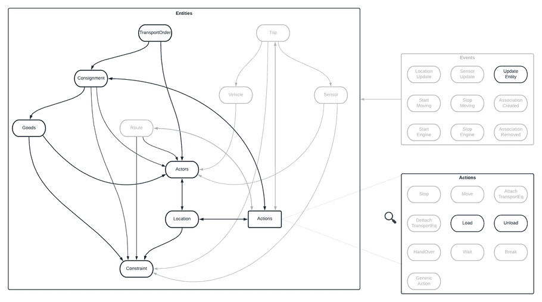

# OTM Profile - Transport order

:::info
The message models of OTM profiles are specified and maintained here: https://sutc.semantic-treehouse.nl/specifications

Direct link to the [OTM Profile - Transport order v1](https://sutc.semantic-treehouse.nl/message-model/MessageModel_30ae15cb-f8d0-404a-8cd6-6cc57f0278fe)
:::

## Overview

The very first step of transporting goods from one place to another starts with the **transport order**. It is concerned with what needs to be transported under what conditions (i.e. before a certain date, or below a certain temperature). It is generally the initial communication between a **shipper** and a **carrier**. Afterwards, the transport order is served as input in creating actual planning data.

## Profile structure

At the bottom of the hierarchy we have `goods`, physical units with dimensions, weights, etc. that need to be transported. Goods are part of a `consignment`, which is an administrative unit that groups the goods together. Note that groups within one consignment cannot be split, they are always part of the same transported unit. If goods need or can be split they should be part of different consignments.

On the top of the chain, we have the `transport order`, that is able to group multiple consignments. For example, because they are part of one assignment given by a shipper.

This can be visualized as follows, where the grayed out entities, associations, events and actions are not relevant for this profile:



The minimal information requirements for a transport order include:
- At least have one consignment
- At least one goods item in a consignment to be transported
- A consignment has at least have one load action and one unload action
- Every load and unload action has a location specified
- All other fields are optional. For example, each consignment can have constraints specifying the delivert time window

The full message specification of the Transport order profile is described here: [OTM Profile - Transport order v1](https://sutc.semantic-treehouse.nl/message-model/MessageModel_30ae15cb-f8d0-404a-8cd6-6cc57f0278fe).


## Example

Lets imagine we want to create a `transportOrder` for some evidence that needs to be transported from the police station
headquarters to the investigation lab. The template starts out with a `transportOrder` that has some external ID, a description,
and empty `actors` and `consignments`:

```json
{
  "id": "58885aa4-fda3-488b-8930-f5867edac095",
  "externalAttributes": {
    "transportOrderId": "12345"
  },
  "description": "Example transport order",
  "actors": [ ],
  "consignments": [ ]
}
```

From here on out we start by adding the relevant parties. For this particular `transportOrder` there are three parties involved:
1. The shipper that is responsible for the goods that need to be carried from location A to location B.
2. The carrier responsible for the actual transportation of the goods.
3. The receiver, that ultimately the receives the location at some point.

So we add these actors to the JSON. Note that the shipper and receiver have a location (since those need to be
visited). And that both locations have various levels of detail:

```json
[
  {
    "entity": {
      "id": "36bbd811-1342-4890-8dd0-1684bba0afa2",
      "name": "Police station Amsterdam",
      "contactDetails": [
        {
          "value": "0900 8844",
          "type": "phone"
        }
      ],
      "locations": [
        {
          "entity": {
            "id": "65a45b12-4096-4b76-a474-27ab635d3ed2",
            "geoReference": {
              "name": "Police head quarters",
              "street": "Elandsgracht",
              "houseNumber": "117",
              "city": "Amsterdam",
              "type": "addressGeoReference"
            }
          },
          "associationType": "inline"
        }
      ]
    },
    "roles": [ "shipper" ],
    "associationType": "inline"
  },
  {
    "entity": {
      "id": "502d5eff-dc3a-45c6-a247-e664b9b70c96",
      "name": "Investigation bureau",
      "contactDetails": [
        {
          "value": "investigation@bureau.com",
          "type": "email"
        }
      ],
      "locations": [
        {
          "entity": {
            "id": "65a45b12-4096-4b76-a474-27ab635d3ed2",
            "geoReference": {
              "lat": 52.0930345,
              "lon": 5.1174618,
              "type": "latLonPointGeoReference"
            },
            "administrativeReference": {
              "name": "Investigation bureau",
              "street": "De Neude",
              "city": "Utrecht"
            }
          },
          "associationType": "inline"
        }
      ]
    },
    "roles": [ "receiver" ],
    "associationType": "inline"
  },
  {
    "entity": {
      "id": "502d5eff-dc3a-45c6-a247-e664b9b70c96",
      "name": "Logistics B.V.",
      "contactDetails": [
        {
          "value": "Carrier company Logistics B.V.",
          "type": "name"
        }
      ]
    },
    "roles": [ "carrier" ],
    "associationType": "inline"
  }
]
```

Now that we have all the involved parties we can focus on the goods that need to be transported. For that we
create a consignment (the evidence), that contains two pieces of items (of the same type). These goods also have
the added constraint that they need to be kept at 'room temperature' (between 15 and 25 degrees) at all times:

```json
{
  "entity": {
    "id": "6819cb23-7941-4004-9b1b-f2a5c0302839",
    "status": "accepted",
    "goods": [
      {
        "entity": {
          "id": "8090bc95-9217-4d92-82d7-ed0a46a024fb",
          "name": "Evidence",
          "externalAttributes": {
            "evidenceId": "306036-10000"
          },
          "description": "two pieces of evidence, 100kg each that need to be stored at room temperature",
          "quantity": 2,
          "weight": {
            "value": 100,
            "unit": "kg"
          },
          "packagingMaterial": "EURO",
          "constraint": {
            "entity": {
              "id": "af061b25-be4b-4716-aec8-92189949f9a0",
              "value": {
                "sensorValueConstraintType": "range",
                "maximum": {
                  "value": 25,
                  "unit": "C"
                },
                "minimum": {
                  "value": 15,
                  "unit": "C"
                },
                "type": "sensorValueConstraint"
              }
            },
            "associationType": "inline"
          },
          "type": "items"
        },
        "associationType": "inline"
      }
    ],
  }
}
```

Now that the consignment has been created we can couple all things together and add the load and
unload actions from the shipping party to the receiving party. Since we already declared the locations
inline we can now reference them:

```json
[
  {
    "entity": {
      "id": "2c0aaccf-d39b-4ed4-97f1-5acf24ae0d0b",
      "location": {
        "uuid": "65a45b12-4096-4b76-a474-27ab635d3ed2",
        "entityType": "location",
        "associationType": "reference"
      },
      "startTime": "2021-08-11T10:00:00Z",
      "endTime": "2021-08-11T13:00:00Z",
      "actionType": "load"
    },
    "associationType": "inline"
  },
  {
    "entity": {
      "id": "99257220-dd3c-4d3f-9078-34b42ee157ad",
      "location": {
        "uuid": "65a45b12-4096-4b76-a474-27ab635d3ed2",
        "entityType": "location",
        "associationType": "reference"
      },
      "startTime": "2021-08-11T16:00:00Z",
      "endTime": "2021-08-11T19:00:00Z",
      "actionType": "unload"
    },
    "associationType": "inline"
  }
]
```

And that's it! So the whole example becomes:

```json
{
  "id": "58885aa4-fda3-488b-8930-f5867edac095",
  "externalAttributes": {
    "transportOrderId": "12345"
  },
  "description": "Example transport order",
  "consignments": [
    {
      "entity": {
        "id": "6819cb23-7941-4004-9b1b-f2a5c0302839",
        "status": "accepted",
        "goods": [
          {
            "entity": {
              "id": "8090bc95-9217-4d92-82d7-ed0a46a024fb",
              "name": "Evidence",
              "externalAttributes": {
                "evidenceId": "306036-10000"
              },
              "description": "two pieces of evidence, 100kg each that need to be stored at room temperature",
              "quantity": 2,
              "weight": {
                "value": 100,
                "unit": "kg"
              },
              "packagingMaterial": "EURO",
              "constraint": {
                "entity": {
                  "id": "af061b25-be4b-4716-aec8-92189949f9a0",
                  "value": {
                    "sensorValueConstraintType": "range",
                    "maximum": {
                      "value": 25,
                      "unit": "C"
                    },
                    "minimum": {
                      "value": 15,
                      "unit": "C"
                    },
                    "type": "sensorValueConstraint"
                  }
                },
                "associationType": "inline"
              },
              "type": "items"
            },
            "associationType": "inline"
          }
        ],
        "actions": [
          {
            "entity": {
              "id": "2c0aaccf-d39b-4ed4-97f1-5acf24ae0d0b",
              "location": {
                "uuid": "65a45b12-4096-4b76-a474-27ab635d3ed2",
                "entityType": "location",
                "associationType": "reference"
              },
              "startTime": "2021-08-11T10:00:00Z",
              "endTime": "2021-08-11T13:00:00Z",
              "actionType": "load"
            },
            "associationType": "inline"
          },
          {
            "entity": {
              "id": "99257220-dd3c-4d3f-9078-34b42ee157ad",
              "location": {
                "uuid": "65a45b12-4096-4b76-a474-27ab635d3ed2",
                "entityType": "location",
                "associationType": "reference"
              },
              "startTime": "2021-08-11T16:00:00Z",
              "endTime": "2021-08-11T19:00:00Z",
              "actionType": "unload"
            },
            "associationType": "inline"
          }
        ]
      },
      "associationType": "inline"
    }
  ],
  "actors": [
    {
      "entity": {
        "id": "36bbd811-1342-4890-8dd0-1684bba0afa2",
        "name": "Police station Amsterdam",
        "contactDetails": [
          {
            "value": "0900 8844",
            "type": "phone"
          }
        ],
        "locations": [
          {
            "entity": {
              "id": "65a45b12-4096-4b76-a474-27ab635d3ed2",
              "geoReference": {
                "name": "Police head quarters",
                "street": "Elandsgracht",
                "houseNumber": "117",
                "city": "Amsterdam",
                "type": "addressGeoReference"
              }
            },
            "associationType": "inline"
          }
        ]
      },
      "roles": [ "shipper" ],
      "associationType": "inline"
    },
    {
      "entity": {
        "id": "502d5eff-dc3a-45c6-a247-e664b9b70c96",
        "name": "Investigation bureau",
        "contactDetails": [
          {
            "value": "investigation@bureau.com",
            "type": "email"
          }
        ],
        "locations": [
          {
            "entity": {
              "id": "65a45b12-4096-4b76-a474-27ab635d3ed2",
              "geoReference": {
                "lat": 52.0930345,
                "lon": 5.1174618,
                "type": "latLonPointGeoReference"
              },
              "administrativeReference": {
                "name": "Investigation bureau",
                "street": "De Neude",
                "city": "Utrecht"
              }
            },
            "associationType": "inline"
          }
        ]
      },
      "roles": [ "receiver" ],
      "associationType": "inline"
    },
    {
      "entity": {
        "id": "502d5eff-dc3a-45c6-a247-e664b9b70c96",
        "name": "Logistics B.V.",
        "contactDetails": [
          {
            "value": "Carrier company Logistics B.V.",
            "type": "name"
          }
        ]
      },
      "roles": [ "carrier" ],
      "associationType": "inline"
    }
  ]
}
```

## Validation

You can use the [Validator](../developers/validation) to validate your implementation according to the OTM profile specification.